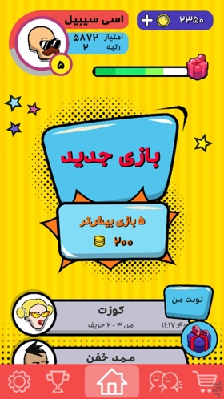
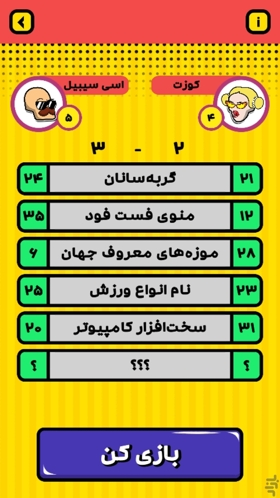
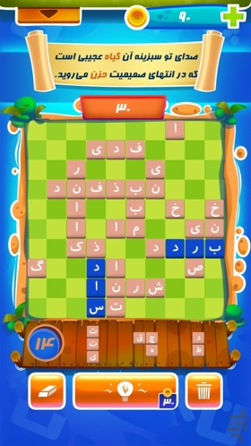
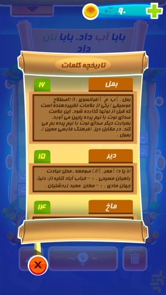
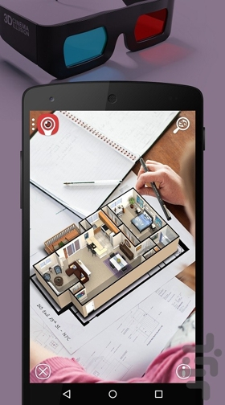
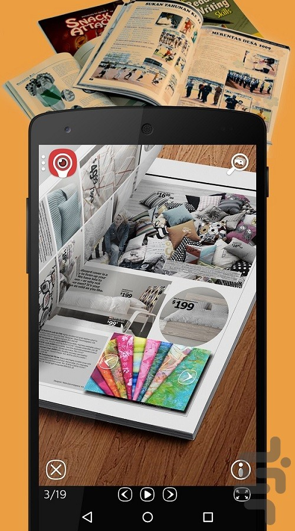
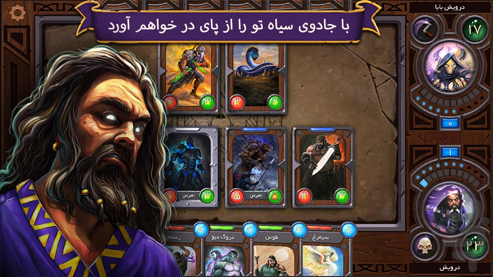
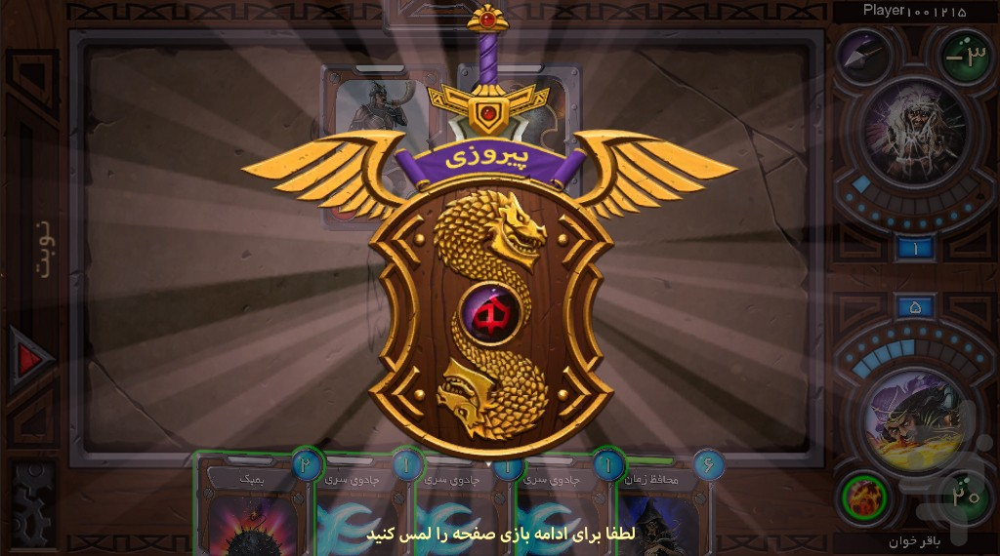
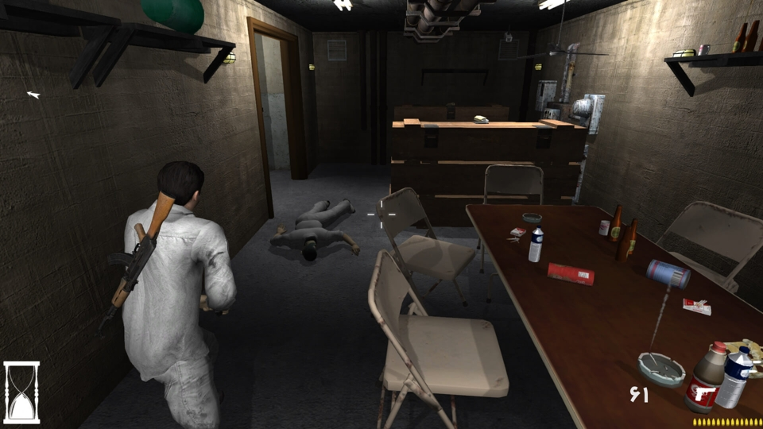
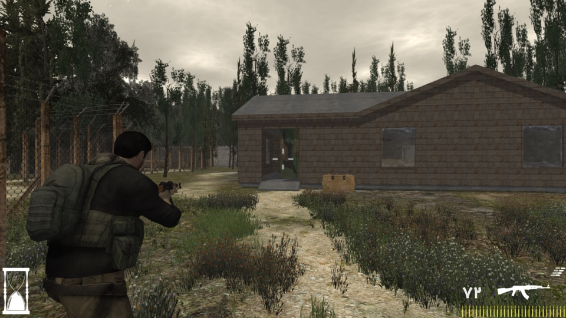

# Arshia's GameDev Portfolio

Welcome! 👋🏻

Below, you will find my most notable gamedev-related projects in reverse chronological order. I would have liked to make this portfolio a cool-looking website or something but, being a programmer, I'm much better with text files than I am with graphics, so here we are... Anyway, here goes:

## Medad Jangi

This is my second and latest indie mobile game, developed with Unity on the client side and ASP.NET core on the backend side, in a team of 3 in which I was the sole developer.

It's a multiplayer trivia game, in which players take turns writing words and phrases related to a subject that the game chooses. The game was well-received and was performing well in the soft launch period. Unfortunately, development was halted due to the team members' busy personal lives before the game could go on to become a success, so we pulled it from the app stores.

Our biggest challenge was text input. Unity's native text input controls open a separate textbox in the Android UI with an OK button, which will then send the text to the text input component in the game. Typing is the main mechanic in the game, so we obviously needed something better; eventually, I ended up making a native plugin for interacting directly with the Android soft keyboard, along with a customized version of TextMesh Pro's text input control on the Unity side.

The source code for the game's [server](https://github.com/Arshia001/FLServer) and [client](https://github.com/Arshia001/FLClient) are available on GitHub, as is the [native keyboard plugin](https://github.com/Arshia001/NativeIMM).

## Kadkhoda

This is my first indie mobile game, developed together with people from the team behind Taaj-o-Takht.

The player is given a 10x10 grid, into which they can place tetris-like pieces. Each cell on each piece contains a letter of the alphabet, and the players must try to place the pieces into the grid in such a way that correct words are formed horizontally or vertically. The end goal of each level is to form a few highlighted words from a proverb or poem. The gameplay ended up being too difficult, and the game was not well-received by players.

The game comes with a complete dictionary of words and meanings, which players can view for any words they can form on the puzzle.

## Taaj-o-Takht

This is a multiplayer online backgammon game with personalization elements. I was the sole developer and the technical director in charge of the project.

The game was developed over an 8-month period, but ultimately failed to launch. Each match had an entry fee and the sum of those entry fees would go to the winner. This, in conjunction with the nature of the game made it a gambling game under the local law, which we could not deal with.

Over the course of the project, I found I had excessive free time, so I decided to make everything more interesting by developing a horizontally scalable architecture over [Orleans](https://github.com/dotnet/orleans); I eventually ended up contributing our [storage driver for Cassandra](https://github.com/OrleansContrib/OrleansCassandraUtils) back to the Orleans project.

The source code for the game's [client](https://github.com/Arshia001/CTClient) and [server](https://github.com/Arshia001/CTServer) are available on GitHub.

## Winkere

Winkere was a unified AR platform. The system consisted of a website for Content Providers, in which they would upload marker images and associate them with a media experience. The users would then use the Android/iOS applications (developed in Unity, which is why Winkere is on this list) to scan the surrounding environment for anything with experiences attached. This would enable people to create talking books, newspapers with video interviews, portfolios with 3D scenes attached, etc. I was the only developer at the startup.

On the server side, we created an image dataset, to which users' marker images would be added. The application would read the image from the phone camera and extract features (via a native plugin based on OpenCV), and send them to the server for matching.

Making the image dataset work was the most difficult thing in the project, followed closely by the actual AR marker tracking, and importing assets into Unity at runtime. 3D scenes were specially difficult to handle due to the many available formats and the inherent complexity of vertex/index lists, associating them with materials, importing textures, lighting, etc.

## HashtKhan

This was a turn-based card battle game, probably best described as a HearthStone clone. I was on the client team alongside 2 other developers.

The game was a local hit, getting over a million downloads, becoming a #1 bestseller, and winning a few technical awards. A second version of the game is still available for download.

## The Dark Days

This is the end result of my first job, which I landed at 19. The game was a third-person shooter inspired by Max Payne, developed at an indie studio with a technical team of just 3 people. I was the sole developer on the team and, being inexperienced and unsupervised, I'm not very proud of the end result... Still, it was the first serious project I was a part of, so it has to be on this list :)

The game was eventually finished, but shipped less than a thousand copies due to legal trouble with the publisher.

